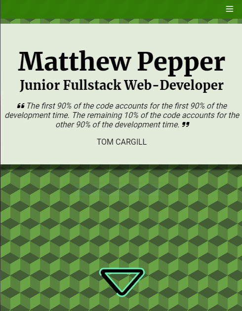

# Portfolio Website

## [My portfolio on Github pages](https://matt-pepper.github.io/Portfolio/)

## Built With
    - HTML
    - Sass / css
    - Javascript

## MVP
- [x] Public Repository
- [x] Readme in Repo
- [x] SCSS for styling
- [x] B.E.M. naming convention
- [x] Responsiveness
- [x] Title section
- [x] About section
- [x] Skill section
- [x] Project section
- [x] Contact section
